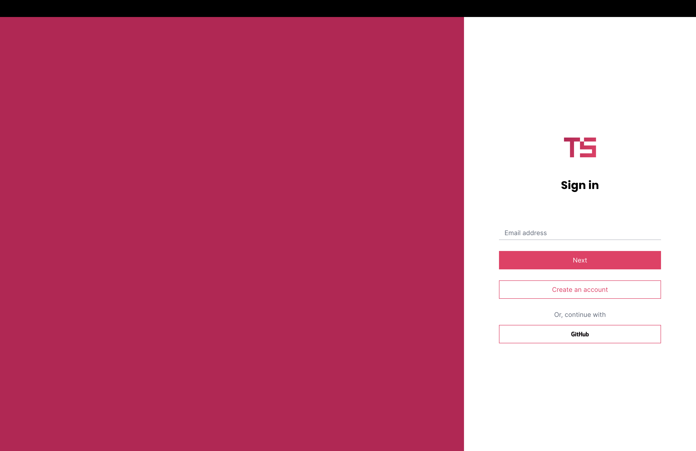
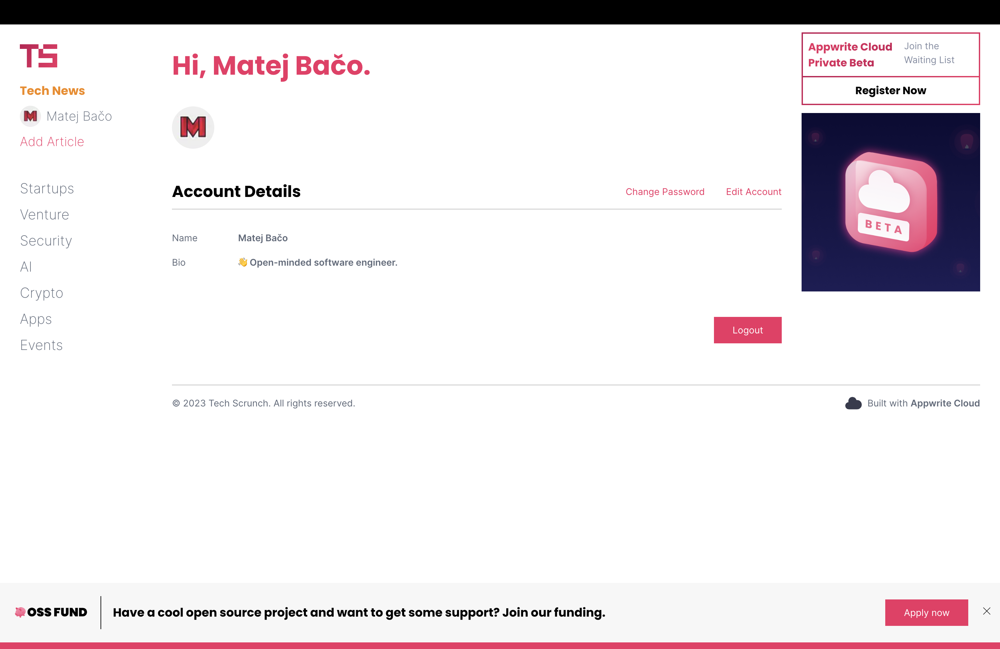
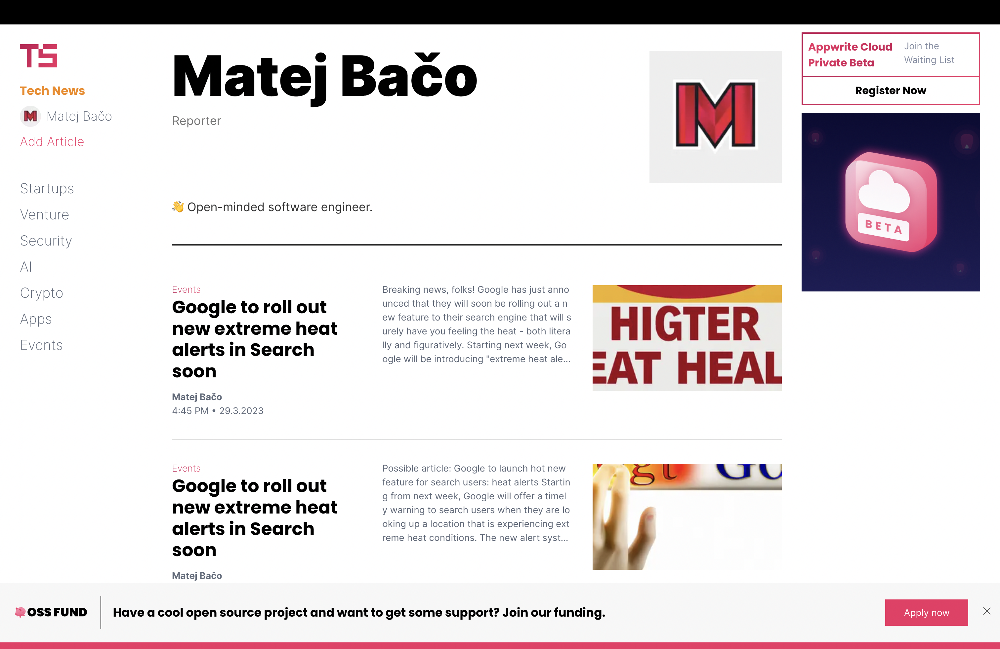
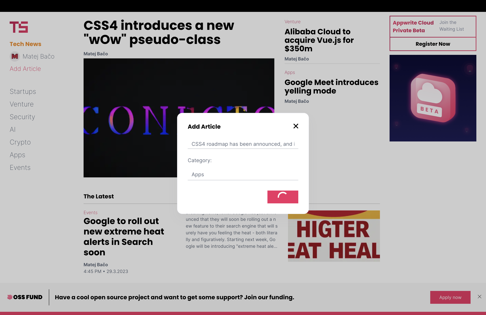

# 📰 TechScrunch

> Website for all your very reliable tech news.


## 🧰 Tech Stack

- [Appwrite](https://appwrite.io/)
- [SvelteKit](https://kit.svelte.dev/)
- [Sass](https://sass-lang.com/)

## 🛠️ Setup Server

1. Setup Appwrite server
2. Create project `techCrunchs`
3. Install Appwrite CLI
4. Login with `appwrite login`
5. Enter `cd appwrite`
6. Deploy initial setup and seeds `sh seed.sh`
7. Set variables on deployed functions. There is `appwrite/functions` folder for each function. They all have `README.md` describing what variables they need
8. Setup `GitHub` OAuth provider

## 👀 Setup Client

1. Install libraries `npm install`
2. Update `endpoint` in `src/lib/AppwriteService.tsts` (Appwrite endpoint from server setup)
3. Start server `npm run dev`

## 🚀 Deploy client

1. Deploy frontend and backend on the same domain. For example, `myapp.com` and `appwrite.myapp.com`
2. Add frontend hostname as a platform in the Appwrite project

## 🚨 Moderation

All moderation can be done in Appwrite Console. `mods` team is present, but the frontend does not provide you with the logic for editing/deleting articles nor categories.

## 🤝 Contributing

To contribute to styles, update SCSS files in `src/lib/styles`. For state management, we use Svelte stores in `src/lib/stores`, and all Appwrite communication is kept in `src/lib/AppwriteService.ts`. To prevent code duplication, we make components out of reusable blocks in `src/lib/components`.

When contributing to backend-related logic, sync up `appwrite/appwrite.json` by running the `appwrite init` commands in the `appwrite` folder. Also, make sure to keep `appwrite/seeds.json` up to date with seeding logic for collections and buckets.

## 🖼️ Screenshots







## 🤖 Auto-generated documentation

Everything you need to build a Svelte project, powered by [`create-svelte`](https://github.com/sveltejs/kit/tree/master/packages/create-svelte).

## Creating a project

If you're seeing this, you've probably already done this step. Congrats!

```bash
# create a new project in the current directory
npm create svelte@latest

# create a new project in my-app
npm create svelte@latest my-app
```

## Developing

Once you've created a project and installed dependencies with `npm install` (or `pnpm install` or `yarn`), start a development server:

```bash
npm run dev

# or start the server and open the app in a new browser tab
npm run dev -- --open
```

## Building

To create a production version of your app:

```bash
npm run build
```

You can preview the production build with `npm run preview`.

> To deploy your app, you may need to install an [adapter](https://kit.svelte.dev/docs/adapters) for your target environment.
